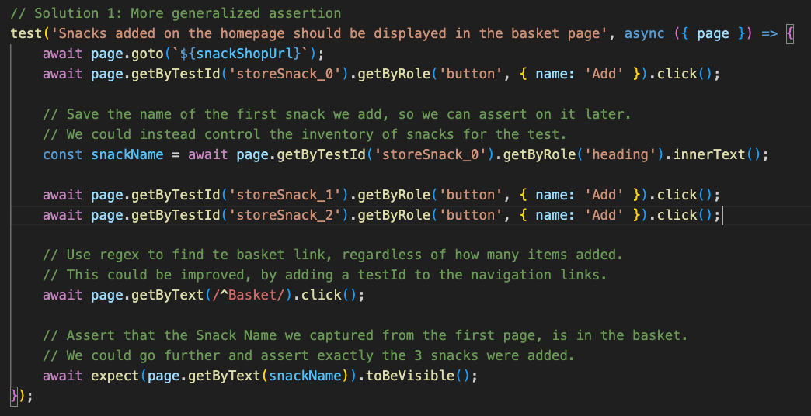

# TestBash Brighton 2024: Code Challenges Workshop

## Challenge 1: Improving an existing test

### Scenario

`snacks.spec.ts`, this test was created last week using the Playwright record option, it worked great first time round, and it passed code review with a demo done on the developers machine.

Since then, it’s been failing for everyone else, can you figure out why and fix it?

### Instructions

Start with [snack-shop-sit/ui-tests/snacks.spec.ts](../../snack-shop-sit/ui-tests/snacks.spec.ts).

Run the test:

```bash
# starting from snack-shop folder
cd snack-shop-sit
npm run test:ui
```

You will notice, the test is failing. Because the names of the snacks in this deployment are different. The simplest and quickest short term fix, is to observe the failed test, and update the { name: 'Snacktastic Mixed Nuts' } on line 14, to the correct name of the first snack in the basket.

To make the fix more permanent, you will need to find a more reliable way assert that snacks have been added to the basket.

Playwright docs that might help:

- <https://playwright.dev/docs/locators>
- <https://playwright.dev/docs/test-assertions>

Feel free to ask for help, search for answers or use something like Chat GPT. Make sure, when doing an interview task, that you ask ahead of time if using an Ai assistant is acceptable, and be up front if you have used one.

Think about how else you could improve the test, remember to note your ideas down. You don't have to implement them now.

### [Optional] Side quests

Got a little more time? Want an extra challenge?

Take one of these optional side quests:

- Naming tests is important, this test is called "test", come up with a better one
- Make this test more robust and immune to flakes

### Solution (spoiler alert!)

Here's one I made earlier, this is one possible solution:

<https://github.com/make-believe-labs/snack-shop/blob/test-bash-24-solutions/snack-shop-sit/ui-tests/snacks.spec.ts>

